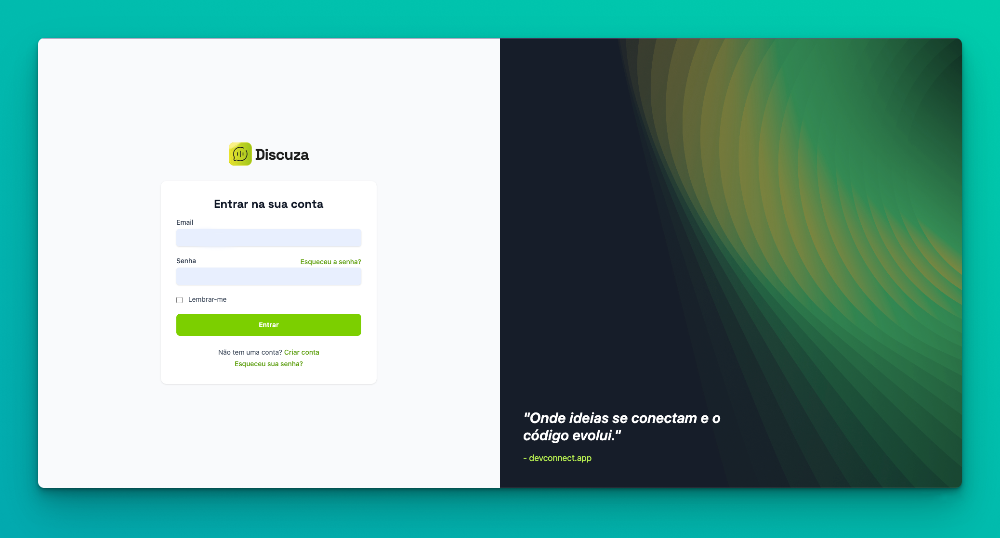
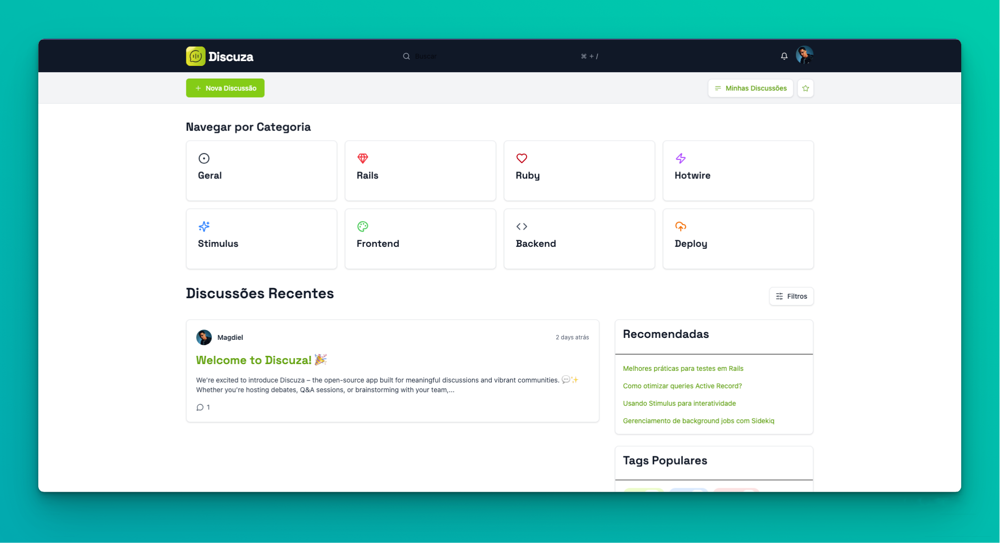

<div align="center">
  
  <p>A modern open-source discussion platform built with Ruby on Rails.</p>
  <p>
    <a href="#english">English</a> | <a href="#português">Português</a>
  </p>

  <!-- GitHub Badges/Widgets -->
  <p>
    <a href="https://opensource.org/licenses/MIT"></a>
    <a href="https://github.com/magdielcardoso/discuza/graphs/contributors"></a>
    <a href="https://github.com/magdielcardoso/discuza/issues"></a>
    <a href="https://github.com/magdielcardoso/discuza/stargazers"></a>
  </p>
</div>

---

<a name="english"></a>
## English Content

<!-- ******************************************** -->
<!-- *              QUICK START                 * -->
<!-- ******************************************** -->
<div align="center">
  <h2>🚀 Quick Start (Using Make) 🚀</h2>
  <p>The easiest way to set up and run the project locally.</p>
</div>

```bash
# 1. Clone the repository and enter the folder
git clone https://github.com/magdielcardoso/discuza.git
cd discuza

# 2. Run the automated setup
make setup

# 3. Configure credentials (required the first time)
#    Follow the instructions in the editor that opens.
make credentials

# 4. Start the server
make start
```
<p align="center">Access the application at <code>http://localhost:3000</code>. See other useful commands with <code>make help</code>.</p>

---

## 🚀 About Discuza

Discuza is a platform designed to facilitate online discussions in an organized and efficient way. Built with the robustness of Ruby on Rails and the interactivity of Hotwire (Turbo + Stimulus), it offers a fast and modern user experience.

## ✨ Key Features (Planned)

*   Discussion Topic Creation
*   Nested Reply System
*   Post Reactions
*   User Authentication (Devise)
*   User Profiles
*   Real-time Notifications (Action Cable)
*   Markdown Support in Messages
*   Efficient Search

## 📸 Screenshots

See what Discuza looks like:

### Login Page



### Main Dashboard



---

## 🛠️ Running Locally (Manual Steps)

Follow these steps to set up the development environment manually (alternative to `make setup`):

1.  **Clone the repository:**
    ```bash
    git clone https://github.com/magdielcardoso/discuza.git
    cd discuza
    ```

2.  **Install dependencies:**
    *   Make sure you have the correct Ruby version installed (check `.ruby-version`). Use a manager like `rbenv` or `rvm`.
    *   Install Bundler: `gem install bundler`
    *   Install gems and dependencies (includes JS via importmap and Tailwind): `bundle install`

3.  **Configure the Database:**
    *   Make sure you have PostgreSQL installed and running.
    *   Check the `config/database.yml` file. Database credentials (user, password, host) must be configured, preferably using environment variables (see step 5).
    *   Create the database: `rails db:create`
    *   Run migrations: `rails db:migrate`
    *   (Optional) Populate with initial data: `rails db:seed` (if `db/seeds.rb` is configured).

4.  **Configure Credentials:**
    *   Generate your own local `config/master.key` and `config/credentials.yml.enc` files. These files are ignored by Git.
    ```bash
    bin/rails credentials:edit
    ```
    *   Add any secrets needed for development in the editor that opens (or leave it empty if none are needed locally).

5.  **Configure Environment Variables:**
    *   Copy the example file (if it exists): `cp .env.example .env`
    *   Edit the `.env` file and fill in the necessary variables (API keys, etc.). If `.env.example` does not exist, create `.env` as needed for your application's settings (e.g., external service credentials).

6.  **Start the Server:**
    ```bash
    # Use the Procfile to start the processes (Rails server, Tailwind watch)
    ./bin/dev
    ```
    Access the application at `http://localhost:3000`.

7.  **Running Tests:**
    ```bash
    # Run all tests
    rails test
    ```

## 🤖 AI Development (StanDev)

This project uses an AI Coding Agent (StanDev) to accelerate development. To collaborate effectively:

```markdown
### System Prompt Summary (StanDev)

*   **Prioritize Rails Generators:** Use `rails g` whenever possible (scaffold, model, controller, migration, etc.).
*   **Test Everything:** No features without tests (`rails g test_unit:..`).
*   **Document Progress:** Update `standev/app_progress.md`.
*   **Vanilla Rails:** Avoid external gems unless necessary; use ActiveRecord, ActiveStorage, Mailer, Jobs, Turbo/Stimulus.
*   **ERB Partials:** Use partials (`_partial.html.erb`) to organize views.
*   **Simplicity:** Lightweight controllers, logic in models/services, focus on incremental delivery.
```

*   **Follow Guidelines:** The AI follows internally defined guidelines (you can consult them in our chat or in a dedicated file like `standev/README_AGENT.md`, if created).
*   **Review Progress:** The `standev/app_progress.md` file (if it exists) is updated by the AI with task status. Review it regularly. If it doesn't exist, ask the AI to create it.
*   **Focus on Clear Tasks:** When requesting features, provide clear and objective instructions. The AI prioritizes Rails generators and tests.
*   **Atomic Commits:** The AI will try to make small, focused commits. Review Pull Requests or proposed changes.

## 🤝 How to Contribute

We are an open-source project and would love your help!

1.  Fork the project.
2.  Create a Branch for your feature (`git checkout -b feature/MyFeature`).
3.  Commit your changes (`git commit -m 'Add some MyFeature'`).
4.  Push to the Branch (`git push origin feature/MyFeature`).
5.  Open a Pull Request.

Please make sure your tests pass and follow the project's code style.

## 📄 License

This project is licensed under the MIT License. See the `LICENSE` file for more details.

## ✨ Acknowledgements

*   To the Ruby on Rails community.
*   To the project contributors.

## 🚀 Deploying with Kamal

This project is configured for continuous deployment using [Kamal](https://kamal-deploy.org/). Follow these basic steps to deploy:

1.  **Configure Servers:**
    *   Ensure you have one or more servers (VMs) accessible via SSH with Docker installed.

2.  **Prepare Deploy File:**
    *   Copy the example file: `cp config/deploy.yml.example config/deploy.yml`
    *   Review and adjust the new `config/deploy.yml` file with your server details (IPs/hostnames), Docker image name, your domain, etc. Remember this file should not be committed (it's in `.gitignore`).

3.  **Prepare Secrets File:**
    *   Copy or rename the example file: `cp .kamal/secrets.example .kamal/secrets`
    *   This file must contain the credentials needed for deployment, such as:
        *   `KAMAL_REGISTRY_PASSWORD`: Password for your Docker registry (e.g., Docker Hub PAT).
        *   `RAILS_MASTER_KEY`: The content of your `config/master.key` file.
        *   `DATABASE_PASSWORD` or `POSTGRES_PASSWORD`: Database password, if applicable and configured in `deploy.yml`.
    *   Edit the new `.kamal/secrets` file and fill in your actual credentials.
    *   **Security:** Ideally, pull these secrets from a password manager or environment variables, as suggested in the example file's comments. **Do not commit the `.kamal/secrets` file to Git if it contains real passwords.** (Add `.kamal/secrets` to your `.gitignore`).

4.  **Initial Setup (First time):**
    *   Run setup to install Traefik, configure Docker, etc., on the servers.
    ```bash
    kamal setup
    ```

5.  **Deploy:**
    *   Run deploy to build the image, push it, and start/update the containers.
    ```bash
    kamal deploy
    ```

6.  **Useful Commands:**
    *   `kamal details`: View configuration details.
    *   `kamal logs`: View application logs.
    *   `kamal app exec 'bin/rails c'`: Open Rails console on the server.
    *   `kamal traefik --help`: Commands for managing Traefik.
    *   `kamal accessory --help`: Commands for managing accessories (e.g., database).

---
<br>
<br>
---

<a name="português"></a>
## Conteúdo em Português

<!-- ******************************************** -->
<!-- *           INSTALAÇÃO RÁPIDA            * -->
<!-- ******************************************** -->
<div align="center">
  <h2>🚀 Instalação Rápida (Usando Make) 🚀</h2>
  <p>A forma mais fácil de configurar e rodar o projeto localmente.</p>
</div>

```bash
# 1. Clone o repositório e entre na pasta
git clone https://github.com/magdielcardoso/discuza.git
cd discuza

# 2. Rode o setup automatizado
make setup

# 3. Configure as credenciais (necessário na primeira vez)
#    Siga as instruções no editor que abrir.
make credentials

# 4. Inicie o servidor
make start
```
<p align="center">Acesse a aplicação em <code>http://localhost:3000</code>. Veja outros comandos úteis com <code>make help</code>.</p>

---

## 🚀 Sobre o Discuza

Discuza é uma plataforma projetada para facilitar discussões online de forma organizada e eficiente. Construída com a robustez do Ruby on Rails e a interatividade do Hotwire (Turbo + Stimulus), oferecendo uma experiência de usuário rápida e moderna.

## ✨ Funcionalidades Principais (Planejadas)

*   Criação de Tópicos de Discussão
*   Sistema de Respostas Aninhadas
*   Reações a Posts
*   Autenticação de Usuários (Devise)
*   Perfis de Usuário
*   Notificações em Tempo Real (Action Cable)
*   Markdown Suportado nas Mensagens
*   Busca Eficiente

## 📸 Screenshots

Veja como o Discuza se parece:

### Página de Login


### Dashboard Principal


---

## 🛠️ Rodando Localmente (Passos Manuais)

Siga estes passos para configurar o ambiente de desenvolvimento manualmente (alternativa ao `make setup`):

1.  **Clone o repositório:**
    ```bash
    git clone https://github.com/magdielcardoso/discuza.git
    cd discuza
    ```

2.  **Instale as dependências:**
    *   Certifique-se de ter a versão correta do Ruby instalada (verifique `.ruby-version`). Use um gerenciador como `rbenv` ou `rvm`.
    *   Instale o Bundler: `gem install bundler`
    *   Instale as gems e dependências (inclui JS via importmap e Tailwind): `bundle install`

3.  **Configure o Banco de Dados:**
    *   Certifique-se de ter o PostgreSQL instalado e rodando.
    *   Verifique o arquivo `config/database.yml`. As credenciais do banco de dados (usuário, senha, host) devem ser configuradas, preferencialmente usando variáveis de ambiente (ver passo 5).
    *   Crie o banco de dados: `rails db:create`
    *   Rode as migrações: `rails db:migrate`
    *   (Opcional) Popule com dados iniciais: `rails db:seed` (se `db/seeds.rb` estiver configurado).

4.  **Configure as Credenciais:**
    *   Gere seus próprios arquivos locais `config/master.key` e `config/credentials.yml.enc`. Estes arquivos são ignorados pelo Git.
    ```bash
    bin/rails credentials:edit
    ```
    *   Adicione quaisquer segredos necessários para desenvolvimento no editor que abrir (ou deixe vazio se nenhum for necessário localmente).

5.  **Configure Variáveis de Ambiente:**
    *   Copie o arquivo de exemplo (se existir): `cp .env.example .env`
    *   Edite o arquivo `.env` e preencha as variáveis necessárias (chaves de API, etc.). Se `.env.example` não existir, crie `.env` conforme necessário para as configurações da sua aplicação (ex: credenciais de serviços externos).

6.  **Inicie o Servidor:**
    ```bash
    # Use o Procfile para iniciar os processos (Rails server, Tailwind watch)
    ./bin/dev
    ```
    Acesse a aplicação em `http://localhost:3000`.

7.  **Rodando os Testes:**
    ```bash
    # Rode todos os testes
    rails test
    ```

## 🤖 Desenvolvimento com IA (StanDev)

Este projeto utiliza uma IA Agente de Codificação (StanDev) para acelerar o desenvolvimento. Para colaborar efetivamente:

```markdown
### Resumo do System Prompt (StanDev)

*   **Priorize Geradores Rails:** Use `rails g` sempre que possível (scaffold, model, controller, migration, etc.).
*   **Teste Tudo:** Nenhuma funcionalidade sem testes (`rails g test_unit:..`).
*   **Documente o Progresso:** Atualize `standev/app_progress.md`.
*   **Rails Vanilla:** Evite gems externas sem necessidade; use ActiveRecord, ActiveStorage, Mailer, Jobs, Turbo/Stimulus.
*   **Partials ERB:** Use parciais (`_partial.html.erb`) para organizar as views.
*   **Simplicidade:** Controllers leves, lógica nos models/services, foco em entrega incremental.
```

*   **Siga as Diretrizes:** A IA segue as diretrizes definidas internamente (você pode consultá-las na nossa conversa ou em um arquivo dedicado como `standev/README_AGENT.md`, se criado).
*   **Revise o Progresso:** O arquivo `standev/app_progress.md` (se existir) é atualizado pela IA com o status das tarefas. Revise-o regularmente. Se não existir, peça para a IA criá-lo.
*   **Foco em Tarefas Claras:** Ao solicitar funcionalidades, forneça instruções claras e objetivas. A IA prioriza geradores Rails e testes.
*   **Commits Atômicos:** A IA tentará fazer commits pequenos e focados. Revise os Pull Requests ou as alterações propostas.

## 🤝 Como Contribuir

Somos um projeto open-source e adoraríamos sua ajuda!

1.  Faça un Fork do projeto.
2.  Crie uma Branch para sua feature (`git checkout -b feature/MinhaFeature`).
3.  Faça commit de suas alterações (`git commit -m 'Add some MyFeature'`).
4.  Faça push para a Branch (`git push origin feature/MyFeature`).
5.  Abra um Pull Request.

Por favor, certifique-se de que seus testes passam e siga o estilo de código do projeto.

## 📄 Licença

Este projeto está licenciado sob a Licença MIT. Veja o arquivo `LICENSE` para mais detalhes.

## ✨ Agradecimentos

*   À comunidade Ruby on Rails.
*   Aos contribuidores do projeto.

## 🚀 Deploy com Kamal

Este projeto está configurado para deploy contínuo usando [Kamal](https://kamal-deploy.org/). Siga os passos básicos para fazer deploy:

1.  **Configure os Servidores:**
    *   Certifique-se de ter um ou mais servidores (VMs) acessíveis via SSH com Docker instalado.

2.  **Prepare o Arquivo de Deploy:**
    *   Copie o arquivo de exemplo: `cp config/deploy.yml.example config/deploy.yml`
    *   Revise e ajuste o novo arquivo `config/deploy.yml` com os detalhes dos seus servidores (IPs/hostnames), nome da imagem Docker, seu domínio, etc. Lembre-se que este arquivo não deve ser commitado (está no `.gitignore`).

3.  **Prepare o Arquivo de Segredos:**
    *   Copie ou renomeie o arquivo de exemplo: `cp .kamal/secrets.example .kamal/secrets`
    *   Este arquivo deve conter as credenciais necessárias para o deploy, como:
        *   `KAMAL_REGISTRY_PASSWORD`: Senha para o seu registry Docker (ex: Docker Hub PAT).
        *   `RAILS_MASTER_KEY`: O conteúdo do seu arquivo `config/master.key`.
        *   `DATABASE_PASSWORD` ou `POSTGRES_PASSWORD`: Senha do banco de dados, se aplicável e configurada no `deploy.yml`.
    *   Edite o novo arquivo `.kamal/secrets` e preencha com suas credenciais reais.
    *   **Segurança:** Idealmente, puxe esses segredos de um gerenciador de senhas ou variáveis de ambiente, conforme sugerido nos comentários do arquivo de exemplo. **Não comite o arquivo `.kamal/secrets` no Git se ele contiver senhas reais.** (Adicione `.kamal/secrets` ao seu `.gitignore`).

4.  **Setup Inicial (Primeira vez):**
    *   Execute o setup para instalar Traefik, configurar Docker, etc., nos servidores.
    ```bash
    kamal setup
    ```

5.  **Deploy:**
    *   Execute o deploy para buildar a imagem, fazer push e iniciar/atualizar os contêineres.
    ```bash
    kamal deploy
    ```

6.  **Comandos Úteis:**
    *   `kamal details`: Ver detalhes da configuração.
    *   `kamal logs`: Ver logs da aplicação.
    *   `kamal app exec 'bin/rails c'`: Abrir console Rails no servidor.
    *   `kamal traefik --help`: Comandos para gerenciar o Traefik.
    *   `kamal accessory --help`: Comandos para gerenciar acessórios (ex: banco de dados).
